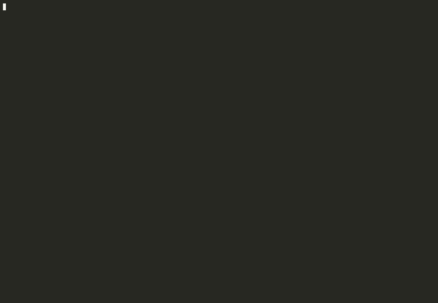

# pi.nvim

Neovim-native frontend for [pi](https://github.com/earendil-works/pi) coding agent.

**Wave 1:** chat/input UI · `pi --mode rpc` · host tools (`nvim_*`) + builtins (`bash`/`read`/`grep`/…) · file-write **mini-diff** in tool bubbles · preview-first review (`<C-r>` / `<C-o>`; disk `edit`/`write` excluded by default so host tools own buffer mutations).

**Wave 2:** busy steer/follow-up · history · model/thinking · fullscreen · session picker · slash `/` · Tab · `]]`/`[[` · Accept/Reject all · `:PiRun` · `nvim_open`/`nvim_goto`.

**Wave 3:** approve modes (`ask`/`smart`/`auto`/`deny` + Always) · `#` skills · hunk `ah`/`rh`/`]h`/`[h` · `:PiExportHtml` · `:PiInspect` · `@visible` · chat/auto · focus · session name · **resume last session** (same cwd).

## Demo

<p align="center">
  
</p>

Source: [`assets/demo.cast.gz`](assets/demo.cast.gz) (asciinema v3, gzipped).

## Requirements

- Neovim ≥ 0.10
- `pi` ≥ 0.84 on `PATH`

## Install (lazy.nvim)

```lua
{
  "AgenticTimes/pi-nvim",
  name = "pi.nvim", -- optional; keeps Lazy UI name as pi.nvim
  lazy = false,
  config = function()
    require("pi").setup({
      keys = { toggle = "<leader>ai" },
      write_on_accept = true,
    })
  end,
}
```

## Usage

| Command | Action |
|---------|--------|
| `:Pi` | Toggle chat UI (`<C-Space>` / `<leader>ai`) |
| `:PiStop` | Abort agent (`require("pi").interrupt()` / `stop()`) |
| `:PiCompact [instructions]` | Compact session context |
| `:PiAutoCompact` | Toggle auto-compaction (`SPC a U`) |
| `:PiNewSession` | New session |
| `:PiDiff` | Open full BEFORE/AFTER preview (same as chat `<C-r>`) |
| `:PiAccept` / `:PiReject` | Accept / reject current pending file (optional; preview-first) |
| `:PiCycleModel` | Cycle model |
| `:PiCycleThinking` | Cycle thinking level |
| `:PiFullscreen` | Toggle fullscreen chat |
| `:PiMaximize [N]` | Solo slot #N / restore tiles |
| `:PiSessions` | Pick session for cwd (also hydrates chat) |
| `:PiRun {msg}` | Open UI + prompt |
| `:PiAcceptAll` / `:PiRejectAll` | Accept / reject all pending |
| `:PiSlash` | Pick slash command |

On Neovim start (`bootstrap = true`), pi starts in the background with no UI; when ready it notifies `pi ready · <C-Space>`. `<C-Space>` (and `<leader>ai`) toggles the slot layout (translucent float; `window.layout = "float"`). Hiding does not stop jobs. Multi-slot (M2): `<leader>a+` new parallel agent, `<leader>a_` close slot, `<leader>a>` cycle primary, `12<leader>w` or `<leader>w` then digits (or `:PiSlot N`) promote that slot to master, `<leader>m` then digits (or `7<leader>m` / `:PiMaximize N`) maximize that slot alone — bare `<leader>m` restores the tile layout; `<leader>a.` / `:PiToggleIdle` hide or show idle slots; primary left, satellites pack right (vertical first, then horizontal) at `slot_min_width` / `slot_min_height`. Capacity = master at min width + sat grid in the rest (ceiling `max_slots`).

On first open, if `resume_last = true` (default), switches to the newest session for the current cwd and fills the chat from history. `,aI` / `:PiNewSession` always starts fresh.

**Edits / review (preview-first):** file writes show a Cursor-style mini-diff inside the tool bubble — top rule = path + `<C-r> full diff`, body = truncated `+/-` hunk. Covers host `replace_in_buffer` / `write` and parsable bash writes (`>`, `>>`, `tee`, `cat > path <<`). Chat: `<C-r>` preview latest touched file · `<C-o>` preview all (cycle `]f`/`[f`). No accept/reject gate required; `:PiAccept` / `:PiReject` / `a`/`r` still work if you want them. `write_on_accept` can silent-write when you accept.

In review buffers: `a`/`r` accept/reject file · `A`/`R` accept/reject all · `ah`/`rh` hunk · `]f`/`[f` next/prev file · `q` close.

In chat: `<CR>` open ask popup (or expand/collapse tool under cursor) · `za` toggle one tool · `ftt`/`ftc` fold/unfold toolcalls · `ftk` fold/unfold thinking · `<C-r>` / `<C-o>` preview edits · `]]`/`[[` next/prev message · `q` close · `<Tab>` toggle ask.

Toolcall / thinking boxes start expanded during a turn; with `auto_fold = true` (default) they fold together on `agent_end` (errors stay open). Top-rule hints: `ftt to fold` / `ftk to fold`, or `<C-r> full diff` on edit bubbles.

In ask popup: `<CR>` submit · `<C-j>` newline · `<Esc>` close popup · `<C-c>` abort · `<Up>`/`<Down>` history · empty `/` slash · `@` mention · empty `#` skills.

Chat layout is OpenCode-style: each role gets its own labelled box — user a rounded blue box, tool calls a square violet box (top/bottom rules + `▌`, no side `│`), thinking a dashed muted box. The role name sits in the top-left corner of the border (`╭─ user ───╮`, `╭┄ thinking ┄╮`, `┌─ toolcall ─┐`, or `┌─ todo.md ─ <C-r> full diff ┐` for edits). Non-edit tools list args (bash shows `$ command`, failures add the error text). Assistant text is plain (`show_thinking = true` by default). Chat buffers use filetype `pi-chat` (Treesitter markdown highlights) so plugins like `render-markdown.nvim` do not overlay the boxes. Open todos from `<cwd>/.pi/todos` (or `PI_TODO_PATH`) stay hidden until `<leader>at`. `closed`/`done` are hidden, and the list refreshes when the `todo` tool finishes while the sidebar is open. While the agent is busy, host configs can show a spinning `Working · Ns` via `require("pi.statusline").lualine()` (wired into lualine in the recommended setup). After edits, the chat may append `◎ N files · <C-r> preview · <C-o> all` and the statusline/winbar can show `Review · N`.

Suggested keys: `<leader>ai` toggle (auto-resume) · `<leader>aI` new session · `<leader>as` sessions · `<leader>at` todo sidebar · `<leader>av` inspect · `<leader>ap` approve mode · `<leader>ah` export HTML · `<leader>ae` focus · `<leader>ac` chat/auto · `<leader>an` name · `<leader>am` pick model · `<leader>ak` pick thinking · `<leader>aM`/`aT` cycle · `<leader>aF` fullscreen · `<leader>aA`/`aR` accept/reject all.

Placeholders in prompts: `@this` `@buffer` `@visible` `@diagnostics` · empty `/` slash · empty `#` skills.

## Tests

```bash
cd ~/source/pi.nvim && nvim -u NONE -l tests/run.lua
```

## Spike demos (still available)

```bash
nvim demo/sample.lua -c "luafile scripts/demo_toolcall_ui.lua"
cd ~/source/pi.nvim && nvim -c "luafile scripts/demo_multifile_ui.lua"
```

## Spec / plan

- `docs/superpowers/specs/2026-09-19-pi-nvim-goose-parity-design.md`
- `docs/superpowers/plans/2026-09-19-pi-nvim-wave1.md`
- `docs/superpowers/specs/2026-10-03-inline-edit-diff-design.md` — host-edit mini-diff
- `docs/superpowers/specs/2026-10-03-file-write-diff-design.md` — bash/disk path-parse diffs
